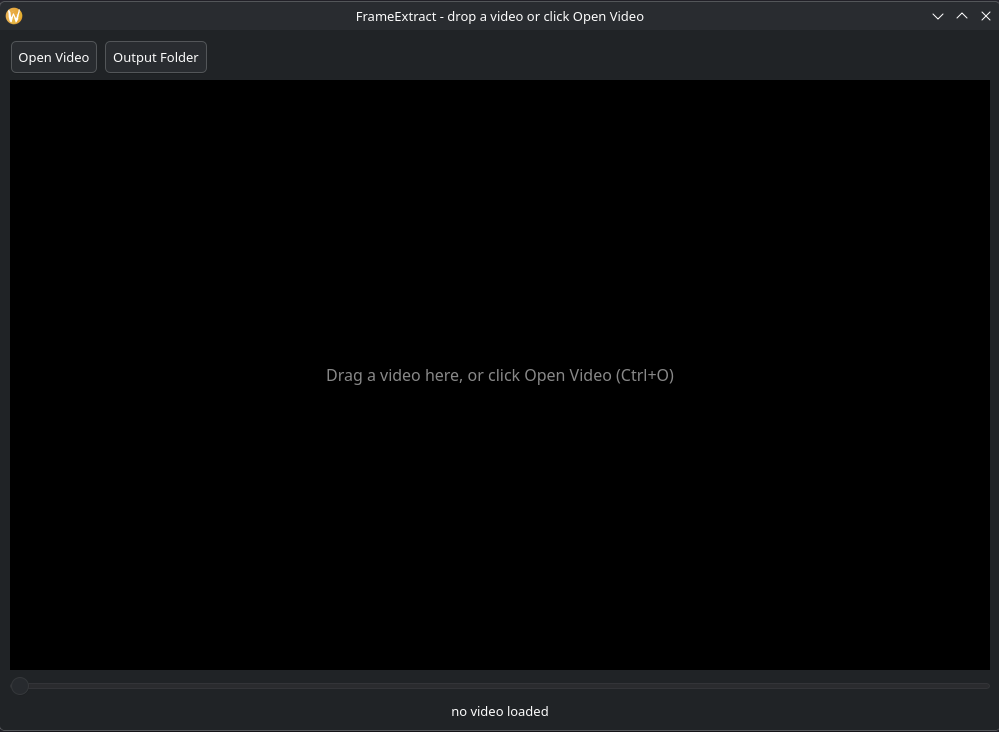
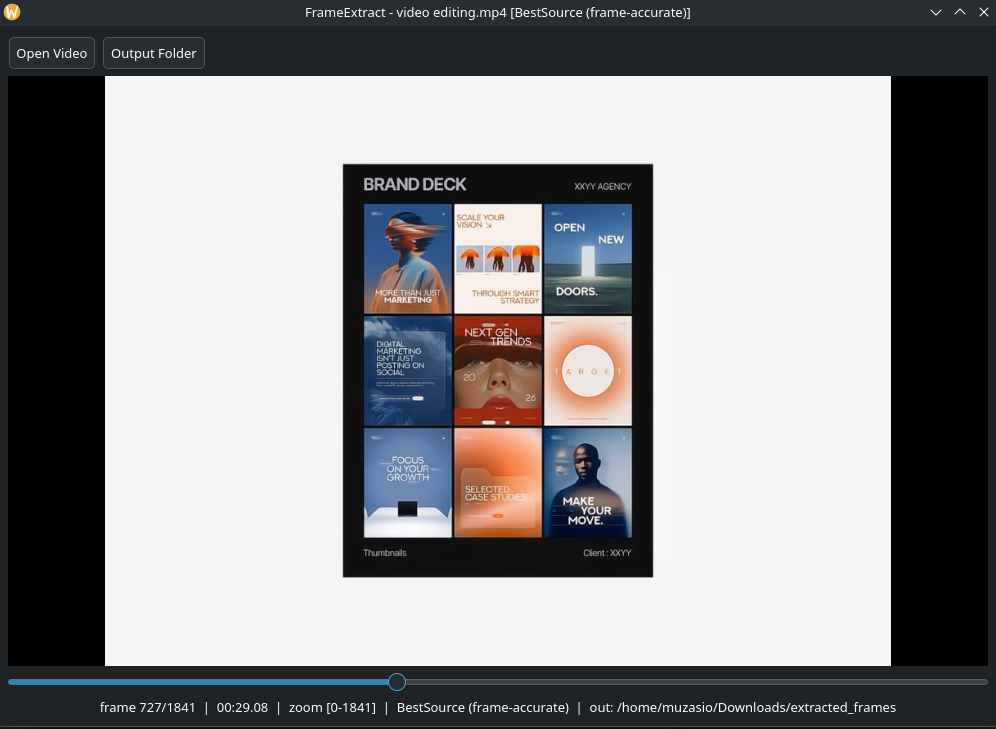
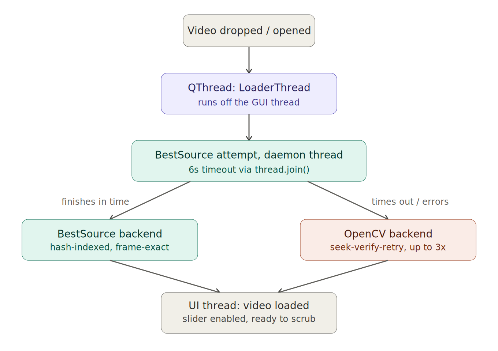

# FrameExtract

A small PyQt6 desktop tool for pulling a single, lossless PNG frame out of any video  drag a file in, scrub a zoomable timeline, hit `S`. No video editor, no screenshot tool, no compression loss.

## The problem

Grabbing one clean frame from a video on Linux usually means one of two bad options: taking a desktop screenshot of a paused player (recompressed, resized by the compositor, wrong resolution), or opening a full video editor just to export one image (slow, disproportionate for a single frame). Neither is fast, and both degrade quality. FrameExtract exists to close that gap  open a file, scrub to the exact frame, save it at source resolution with zero re-encoding.

## Screenshots

| Idle state | Loaded and scrubbing |
|---|---|
|  |  |

## Architecture

Video loading never touches the GUI thread. A `QThread` (`LoaderThread`) handles backend selection in the background, so the window stays responsive  and closable  no matter how long decoding takes.



**Why two backends instead of one:** `cv2.CAP_PROP_POS_FRAMES`  OpenCV's standard seek call  is documented as unreliable on variable frame rate (VFR) footage, which is the default recording mode on most Android cameras. A request for frame 503 can silently return frame 500 while the getter still reports 503 as correct. FrameExtract tries [BestSource](https://github.com/vapoursynth/bestsource) first, a VapourSynth plugin that hash-indexes every frame on first open and guarantees exact seeking afterward. If BestSource isn't installed, fails, or takes longer than 6 seconds (bounded with a daemon-thread timeout so a bad file can never hang the app), it transparently falls back to OpenCV with a seek-verify-retry loop that checks the landed frame after every seek and re-seeks with drift correction. The active backend is always shown in the window title, so you know which guarantee you're getting.

## Features

- Drag-and-drop video onto an open window, or launch via file manager / app launcher drop
- Zoomable timeline  scroll wheel narrows or widens the scrub range around the current frame, for both coarse and frame-by-frame precision
- Frame-exact seeking via BestSource, with an automatic OpenCV fallback
- Lossless PNG export (`IMWRITE_PNG_COMPRESSION 0`) at full source resolution
- Keyboard-first workflow  no mouse required once a video is loaded
- `.desktop` launcher for real OS-level drag-and-drop, not just CLI args

## Installation

Dependencies:

```
paru -S python-pyqt6 python-opencv python-numpy
paru -S vapoursynth vapoursynth-plugin-bestsource
```

The BestSource packages are optional  if they fail to build or you skip them, FrameExtract automatically runs on the OpenCV fallback backend instead.

Install the app:

```
git clone https://github.com/muzasio/frameextract.git
cd frameextract
./install.sh
```

This copies the script to `~/.local/bin/frameextract.py` and registers the desktop launcher at `~/.local/share/applications/frameextract.desktop`, which is what enables dragging a video onto the app icon in your launcher or taskbar.

## Usage

Launch with no argument for an idle drop target, or pass a file directly:

```
frameextract.py
frameextract.py video.mp4
```

| Key | Action |
|---|---|
| `←` / `→` | Step ±1 frame |
| `Shift + ←` / `Shift + →` | Step ±10 frames |
| Mouse wheel over slider | Zoom timeline in/out around current frame |
| `S` or `Enter` | Save current frame as PNG |
| `Ctrl + O` | Open a video file |

Output defaults to `<video_directory>/extracted_frames/`, filename pattern `{videoname}_frame{index:06d}.png`.

## Known limitations

- First open of a video with the BestSource backend triggers a one-time indexing pass (cached to `.bsindex/` next to the source file); subsequent opens of the same file are instant
- BestSource requires AUR packages on Arch-based distros; not available as a standard repo package on most distributions
- GPU-accelerated decode was evaluated and deliberately excluded  this tool's workload is seek-bound (random access into short clips), not throughput-bound, so hardware decode adds a driver dependency without a measurable benefit

## License

MIT  see [LICENSE](LICENSE).
